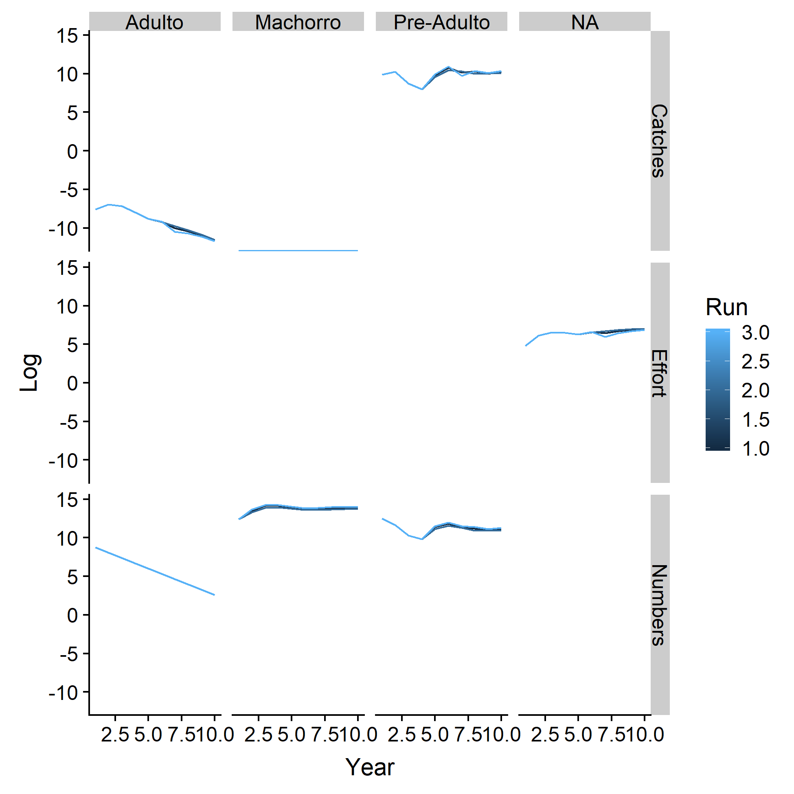

```{r pkg_ins, include= FALSE, warning = FALSE, message = FALSE}

rm(list=ls())

# Check out knitr for knitr::read_chunk.
library(knitr)

# Name packages.
pkg <- c("readr",
         "knitr",
         "tidyverse",
         "gapminder",
         "sandwich",
         "broom",
         "stargazer",
         "cowplot",
         "kableExtra",
         "reshape2",
         "devtools",
         "gridExtra")

# Install packages.
#install.packages(pkg, verbose = FALSE, quiet = TRUE)
#devtools::install_github("AckerDWM/gg3D")
  
# Update packages.
#update.packages(pkg, verbose = FALSE, quiet = TRUE)

# Check out packages.
invisible(lapply(pkg, library, character.only = TRUE))


#library(gg3D)

```

###Objective: Step through optimal aggregate harvest in an open access fishery.
1. Replicate INAPESCA's population model. 
2. Adapt methods to a 10-year forecast.
3. Add price-sensitive effort under open access.
4. Parameterize the model over historic recruitment, stock, and catch data.

 * Each component requires specification of a function from available data and existing models.
  + Right now, each component is specified as a vector, which is convenient but not adequate for what we're doing.
  + Turning everything into functions, or keeping things as functions instead of vectors, is the next step for more complex loops.

####1. Population Model

#####a. Initial Numbers at Age
* Build an initial age structure - numbers at age - from using INAPESCA's median biomass estimate for 2017 and True's function for a stable age structure.
 + Structure from True (2018).
 
$N_a = 121.99 * 10^{-0.214a}$

```{r ninit}

# Vector for initial n at a.
#  Assign initial biomass from INAPESCA estimate.
#  Try the lower bound on the 95% CI of INAPESCA's 2017 estimate from surveys.
biomass_init = 13000000 #32399000 # median biomass estimate from INAPESCA (2018) in kilograms.

#  Assign functional form for frequencies at age from True (2018). See notes on symposium presentation. Check whether curve describes numbers at age.
#fun_a_n = function(a){121.99 * 10 ^ (-0.214 * a)}
# Alternative distribution for tests.
fun_a_n = function(a){121.99 * 10 ^ (-0.09 * a)} # Number's made-up for fun and plausibility tests.

#  Convert numbers at age to sums of weights at age to work from total biomass back to numbers at age.
fun_a_l = function(a, linf, k, t0){l = linf * (1 - exp(-k * (a - t0)))} # INAPESCA (2018): 200, 0.155, -0.65. See notes for alternatives.
fun_l_w = function(a, l, b){w = a * l ^ b} # INAPESCA (2018) / Anda-Montañez et al. (2013): 0.000005, 3.0635. See notes for alternatives.

# Calculations:
#  Vector of ages.
a = seq(1, 27)
#  Vector of lengths.
l = fun_a_l(a, 200, 0.155, -0.65)
#  Vector of weights.
#w = fun_l_w(0.000005, l, 3.0635) This is a wrong thing that makes your numbers bad and wrong.
w = fun_l_w(0.000004128, l, 3.24674) # This is a right thing that makes your numbers good and right.
#  Numbers at age.
afreq = fun_a_n(a)
#  Weights at age.
wfreq = afreq * w
#  Weights at age, but useful.
winit = wfreq * (1 / sum(wfreq)) * biomass_init
#  Numbers at age to seed the model.
ninit = winit / w

```

#####b. Natural Mortalities
* Build constant survival after natural mortality at age. 

Total Mortality at Age:
$N_a = N_0e^{-M_a}$

Marginal Mortality at Age:
$N_a = N_{a-1}e^{-M_a}$

```{r nmort}

# Function for proportional marginal survival at age. From INAPESCA (2018) / Cisneros-Mata et al. (1995).
fun_a_mort = function(n, m){s = n * exp(-m)}

m = 0.268 # Also from INAPESCA (2018) / Cisneros-Mata et al. (1995).
s = fun_a_mort(1, m)
```

#####c. Selectivities at Age, Effort, Catchability, and Catches at Age (THIS SECTION IS SPAGHETII PLEASE SEND HELP)
* Build poaching mortalities at age from INAPESCA data. 
+ Instead of using numbers from 2016 - 2017, sums by age are taken over all years of sampling for a higher *n*.
+ ~~We use numbers for sampled catch at age and numbers at age from 2017.~~
+ Whether this is the best option is open to debate and guidance from advisors.
+ The function fit to mortalities-at-age is a Weibull probability density function. *Alternative functions were not tested.*

+ $f(a) = x \frac{\beta}{\eta} (\frac{T - \gamma}{\eta})^{\beta - 1}e^{-(\frac{T - \gamma}{\eta})^{\beta}}$

```{r fishing, echo = FALSE, warning = FALSE}
# Vector for proportional poaching mortalities at age.
#  Read in values for size-selective poaching from INAPESCA (2018); n = 1147 from 9 periods, 1963 - 2017.
v_select_data = 
  c(6, 9, 15, 60, 191, 281, 165, 133, 82, 33, 27, 21, 17, 10, 12, 16, 8, 15, 9, 12, 7, 9, 5, 2, 2, 0, 0) %>% # All years.
  #c(0, 0, 0, 0, 7, 11, 7, 13, 8, 10, 8, 10, 11, 4, 8, 9, 2, 8, 3, 8, 1, 3, 2, 2, 2, 0) %>% # 2017
  data.frame() %>% 
  mutate(age = seq(1, 27)) %>% 
  rename(n = ".")

#  Estimate fit for a Weibull probability density function. Try weibull.com/hotwire/issue14/relbasics14.htm
nls_select = nls(v_select_data$n ~ ifelse(is.na(x * (a / b) * ((v_select_data$age - c) / b) ^ (a - 1) * exp(-((v_select_data$age - c) / b ) ^ a)),
                                          0,
                                          x * (a / b) * ((v_select_data$age - c) / b) ^ (a - 1) * exp(-((v_select_data$age - c) / b ) ^ a)),
                 v_select_data, 
                 start = list(x = 30, a = 2.5, b = 10, c = -3), 
                 lower = list(0, 0, 0, -Inf),
                 algorithm = "port")

#  Tibbulate nonlinear estimation.
nls_tidy = tidy(nls_select)

#  Use parameters to restate the function on a single dimension (age) for integration.
simple_fun_select = function(t){n = 
                                ifelse(is.na(nls_tidy$estimate[1] * (nls_tidy$estimate[2] / nls_tidy$estimate[3]) * ((t - nls_tidy$estimate[4]) / nls_tidy$estimate[3]) ^ (nls_tidy$estimate[2] - 1) * exp(-((t - nls_tidy$estimate[4]) / nls_tidy$estimate[3] ) ^ nls_tidy$estimate[2])),
                                0,
                                nls_tidy$estimate[1] * (nls_tidy$estimate[2] / nls_tidy$estimate[3]) * ((t - nls_tidy$estimate[4]) / nls_tidy$estimate[3]) ^ (nls_tidy$estimate[2] - 1) * exp(-((t - nls_tidy$estimate[4]) / nls_tidy$estimate[3] ) ^ nls_tidy$estimate[2]))
                                return(n)}

#  Integrate over ages of interest.
int_select = integrate(simple_fun_select, lower = 1, upper = 27)

#  Transform fitted values for poaching selectivity into a probability distribution function using the integral of the unidimensional function.
fun_poach = function(t){n = ifelse(is.na((nls_tidy$estimate[1] / int_select$value) * (nls_tidy$estimate[2] / nls_tidy$estimate[3]) * ((t - nls_tidy$estimate[4]) / nls_tidy$estimate[3]) ^ (nls_tidy$estimate[2] - 1) * exp(-((t - nls_tidy$estimate[4]) / nls_tidy$estimate[3] ) ^ nls_tidy$estimate[2])), 
                                    0, 
                                    (nls_tidy$estimate[1] / int_select$value) * (nls_tidy$estimate[2] / nls_tidy$estimate[3]) * ((t - nls_tidy$estimate[4]) / nls_tidy$estimate[3]) ^ (nls_tidy$estimate[2] - 1) * exp(-((t - nls_tidy$estimate[4]) / nls_tidy$estimate[3] ) ^ nls_tidy$estimate[2]))}

# Plot the fucntion - not the PDF values, just the original values.
plot_weib =
ggplot() + 
  geom_line(aes(seq(1, 27, by = 0.01), simple_fun_select(seq(1, 27, by = 0.01))), color = "Firebrick4") + 
  geom_point(aes(seq(1, 27), v_select_data$n)) +
  labs(x = "Age", y = "Catch") +
  theme_classic()

print(plot_weib)

# Get to selectivity at age from average proportional catch at age through catches at age, numbers at age, and effort in 2017. Catchability estimate is a bonus.
catch = 1400000 # kilograms from tonnes. INAPESCA (2018).
effort = 120 # boat-years in 2017. INAPESCA (2018).
v_select_n = catch * fun_poach(a) / w # Get to catches at age in numbers with catch, proportional catch at age, and weights at age.
v_select_use = v_select_n/(ninit * effort) # Get to just selectivities and catchability by dividing out numbers at age and effort.

# Fit an ONLY SORT OF DIFFERENT Weibull distribution to selectivities and catchability. The integral of this gets you to a factor that happens to be catchability. I guess. Maybe.
# Names are reused because a) lazy and b) the first estimate won't matter after the second one's done.
nls_select = nls(v_select_use ~ ifelse(is.na(x * (a / b) * ((v_select_data$age - c) / b) ^ (a - 1) * exp(-((v_select_data$age - c) / b ) ^ a)),
                                          0,
                                          x * (a / b) * ((v_select_data$age - c) / b) ^ (a - 1) * exp(-((v_select_data$age - c) / b ) ^ a)),
                 v_select_data, 
                 start = list(x = 1, a = 2.5, b = 10, c = -3), 
                 lower = list(0, 0, 0, -Inf),
                 algorithm = "port")

#  Tibbulate nonlinear estimation.
nls_tidy = tidy(nls_select)

#  Use parameters to restate the function on a single dimension (age) for integration.
simple_fun_select = function(t){n = 
                                ifelse(is.na(nls_tidy$estimate[1] * (nls_tidy$estimate[2] / nls_tidy$estimate[3]) * ((t - nls_tidy$estimate[4]) / nls_tidy$estimate[3]) ^ (nls_tidy$estimate[2] - 1) * exp(-((t - nls_tidy$estimate[4]) / nls_tidy$estimate[3] ) ^ nls_tidy$estimate[2])),
                                0,
                                nls_tidy$estimate[1] * (nls_tidy$estimate[2] / nls_tidy$estimate[3]) * ((t - nls_tidy$estimate[4]) / nls_tidy$estimate[3]) ^ (nls_tidy$estimate[2] - 1) * exp(-((t - nls_tidy$estimate[4]) / nls_tidy$estimate[3] ) ^ nls_tidy$estimate[2]))
                                return(n)}

#  Integrate over ages of interest.
int_select = integrate(simple_fun_select, lower = 1, upper = 27)

# Look, that's catchability!
q = int_select$value

#  Transform fitted values for poaching selectivity into a probability distribution function using the integral of the unidimensional function.
fun_poach = function(t){n = ifelse(is.na((nls_tidy$estimate[1] / int_select$value) * (nls_tidy$estimate[2] / nls_tidy$estimate[3]) * ((t - nls_tidy$estimate[4]) / nls_tidy$estimate[3]) ^ (nls_tidy$estimate[2] - 1) * exp(-((t - nls_tidy$estimate[4]) / nls_tidy$estimate[3] ) ^ nls_tidy$estimate[2])), 
                                    0, 
                                    (nls_tidy$estimate[1] / int_select$value) * (nls_tidy$estimate[2] / nls_tidy$estimate[3]) * ((t - nls_tidy$estimate[4]) / nls_tidy$estimate[3]) ^ (nls_tidy$estimate[2] - 1) * exp(-((t - nls_tidy$estimate[4]) / nls_tidy$estimate[3] ) ^ nls_tidy$estimate[2]))}

```

Variable   | Definition                          | Value
---------- | ----------------------------------- | ---------------------------
*f*        | Poaching Mortality                  |
*a*        | Age                                 |
*x*        | Scale Parameter (1)                 | `r nls_tidy$estimate[1]`
$\beta$    | Weibull Slope (Shape Parameter)     | `r nls_tidy$estimate[2]`
$\eta$     | Scale Parameter (2)                 | `r nls_tidy$estimate[3]`
$\gamma$   | Location Parameter                  | `r nls_tidy$estimate[4]`

#####d. Bycatch Mortalities
* Build bycatch mortalities at age from INAPESCA data.
+ These are proportions at age, but since INAPESCA's data is a narrow spread around one year of age, it's easiest to just make bycatch a proportion of juveniles at one age.
+ Since this is a constant value, it's not stored in a function.

```{r bycatch}

# Value for proportional bycatch mortalities at age.
bymort = 1 - 80000 / ninit[2] # Instead of distributing bycatch mortalities, we concentrate them on one age (2) for lack of length-at-age resolution. 
                              # INAPESCA (2018) - estimated for 2011 - 2017.

```

#####e. Reproduction
* Build reproduction from INAPESCA estimates of maturation and egg production by weight.

Maturation at Length | INAPESCA (2018)

$r(l) = (1+e^{\alpha(l-\beta))^{-1}}$ 

Variable   | Definition                          | Value
---------- | ----------------------------------- | ---------------------------
*r*        | Proportion of Mature Females        |
*l*        | Length (millimeters)                |
$\alpha$   | Parameter                           | 0.0099
$\beta$    | Length for $r = 50$                 | 1333.31

Egg Production at Weight | INAPESCA (2018), Valenzuela-Quiñonez (2014)

$e(w) = \alpha e^{\beta w}$ 

Variable   | Definition                          | Value
---------- | ----------------------------------- | ---------------------------
*e*        | Egg Production                      |
*a*        | Age                                 |
*w*        | Weight                              |
$\alpha$   | Parameter                           | 221.76
$\beta$    | Parameter                           | 0.0047

Survival (Egg-Juvenile) | INAPESCA (2018), CREMES (201?)

Stage               | Proportional Survival
------------------- | ----------------------
*Viable Eggs*       | 0.70
*Fertilized Eggs*   | 0.90
*Hatched Larvae*    | 0.95
*Successful Larvae* | 0.10 

Total Recruitment | INAPESCA (2018), Shepherd (1982)

$N_{0, t} = \frac{\alpha N_{a, t-1}}{[1 + (N_{a, t-1} / \beta)]^{\delta}}$

Variable   | Definition                          | Value
---------- | ----------------------------------- | ---------------------------
$N_{0, t}$ | Recruits                            |
$N_{a, t}$ | Cohort of Age *a*                   |
$\alpha$   | Parameter                           | 131.35
$\beta$    | Parameter                           | 3.07
$\delta$   | Parameter                           | 1.639951478

```{r recruitment}

fun_mat = function(a, l, a_mat, b_mat){r = 1 / (1 + exp(a_mat * (l * 10 - b_mat)))} # Proportion of mature females.
  
fun_egg = function(a, l, w, n, r, a_egg, b_egg){e = n * w * r * a_egg * exp(b_egg * l * 10)} # Egg production.
  
fun_sur = function(e, a_sur, b_sur, c_sur, d_sur){s = e * a_sur * b_sur * c_sur * d_sur} # Survival from egg to juvenile.

fun_rec = function(n, a_rec, b_rec, d_rec){n0 = (a_rec * n) / ((1 + n / b_rec) ^ d_rec)} # Total recruitment. Use this one.

```

#####f. Parameters
With intermediate results ready to plug in, everything goes into a vector for model runs and a table for handy external reference.

```{r partab}

# Define parameters for each low-level function in a high-level function of multiple harvests over time.
var = c("rows",
        "cols",
        "biom_init",
        "a_ninit",
        "b_ninit",
        "linf",
        "k,",
        "t0",
        "a_lw",
        "b_lw",
        "s",
        "x_f",
        "b_f",
        "n_f",
        "y_f",
        "bymort",
        "a_rec",
        "b_rec",
        "d_rec",
        "q")

par = c(10, 
        27,
        200,
        32399000,
        121.99,
        -0.09,
        0.155,
        -0.65,
        0.000005,
        3.0635,
        s,
        974.4340378,
        1.745196,
        3.1966691,
        3.8386018,
        0.40,
        131.3474453,
        30700.00,
        1.639951478,
        q)

units = c("Years",
          "Years",
          "Kilograms",
          "-",
          "-",
          "Centimeters",
          "Years (Inverse)",
          "Years",
          "-",
          "-",
          "-",
          "-",
          "-",
          "-",
          "-",
          "%",
          "-",
          "-",
          "-",
          "Catchability")

fun = c(rep("All", 2),
        rep("Initial Age Distribution", 3),
        rep("Von Bertalanffy", 3),
        rep("Weight-Length", 2),
        "Natural Mortality",
        rep("Poaching Selectivity", 4),
        "Bycatch Mortality",
        rep("Recruitment", 3),
        "Catchability")

num = seq(1, length(var))

tab = data.frame(num, fun, var, par)

# Save parameters to working directory.
#kable(tab, digits = 2) %>%
#  kable_styling() %>%
#  save_kable(file = "partab.html", self_contained = T)

```

```{r parstab}

# Define parameters for each low-level function in a high-level function of multiple harvests over time.
#  Choose a number of runs. For a set of estimates including worst-case, best-case, and case-we-think-is-most-likely, there are always no fewer than three runs.
#  This should maybe be chunk 'runs?'
runs = 3

# Set parameters for the "use" case - whatever values we're most interested in.
paruse = c(10, 
           27,
           200,
           32399000,
           121.99,
           -0.09,
           0.155,
           -0.65,
           0.000005,
           3.0635,
           s,
           974.4340378,
           1.745196,
           3.1966691,
           3.8386018,
           0.40,
           131.3474453,
           30700.00,
           1.639951478,
           q)

# Set parameters for the minimum case - the lowest reasonable values for each parameter.
#  This is different from optimistic / pessimistic cases - because a) it just is and b) the change from paruse is absolutely arbitrary in this version.
#  This is also just a mock-up. Remember to fix it.
parmin = paruse
parmin[17] = 100

# Set parameters for the maximum case - the highest reasonable values for each parameter.
#  This is different . . ..
#  This is also just a mock-up. Remember to fix it.
parmax = paruse
parmax[17] = 150

# Stick things into a matrix for runs.
par = as.matrix(cbind(paruse, parmin, parmax))

var = c("rows",
        "cols",
        "biom_init",
        "a_ninit",
        "b_ninit",
        "linf",
        "k,",
        "t0",
        "a_lw",
        "b_lw",
        "s",
        "x_f",
        "b_f",
        "n_f",
        "y_f",
        "bymort",
        "a_rec",
        "b_rec",
        "d_rec",
        "q")

units = c("Years",
          "Years",
          "Kilograms",
          "-",
          "-",
          "Centimeters",
          "Years (Inverse)",
          "Years",
          "-",
          "-",
          "-",
          "-",
          "-",
          "-",
          "-",
          "%",
          "-",
          "-",
          "-",
          "Catchability")

fun = c(rep("All", 2),
        rep("Initial Age Distribution", 3),
        rep("Von Bertalanffy", 3),
        rep("Weight-Length", 2),
        "Natural Mortality",
        rep("Poaching Selectivity", 4),
        "Bycatch Mortality",
        rep("Recruitment", 3),
        "Catchability")

num = seq(1, length(var))

tab = data.frame(num, fun, var, par)

# Save parameters to working directory.
#kable(tab, digits = 2) %>%
#  kable_styling() %>%
#  save_kable(file = "partab.html", self_contained = T)

```

#####g. Iteration

* Model w/ loops and functions run from a vector of parameters.

* Next steps for 2/17:
+ build and fill price matrix
+ build and fill revenue vector
+ get effort parameterized with stiffness.
+ Consider optimization frameworks for stiffness and / or effort (mutually exclusive by implementation).

```{r hoof}

# Build the model.
fi = function(par){
                   # Build objects to fill.
                   n = matrix(nrow = par[1], ncol = par[2]) # Build a matrix of numbers at age.
                   m = matrix(nrow = par[1], ncol = par[2]) # Build a matrix of natural mortalities at age.
                   b = matrix(nrow = par[1], ncol = par[2]) # Build a matrix of bycatch at age.
                   y = matrix(nrow = par[1], ncol = par[2]) # Build a matrix of catch at age.
                   a = matrix(nrow = par[1], ncol = par[2]) # Build a matrix of ages for reference in functions.
                   rec = as.numeric(vector(length = par[1]))  # Build a vector of recruitment at age.
                   e = as.numeric(vector(length = par[1]))  # Build a vector of effort. This is the variable for optimization in the economic component.
                   p = as.numeric(vector(length = par[1]))  # Build a vector of prices at age.
                   rev = as.numeric(vector(length = par[1]))  # Build a vector of total revenues.
                   c = as.numeric(vector(length = par[1]))  # Build a vector of total costs.
                   
                   # Add initial values.
                   a = col(a)
                   
                   n[1,] = ninit # Age distribution for first year, e.g. 2017.
                   
                   m[1,] = n[1,] * (1 - par[11]) # Natural mortalities.
                   
                   b[1,] = (n[1,] - n[1,] * m[1,]) * 0 # Bycatch mortalities by cohort for first year.
                   b[1, 2] = (n[1, 2] - m[1, 2]) * par[16] # Bycatch mortality for the single cohort actually affected.
                   
                   e[1] = 120 # Effort in boats/season for 2017 (INAPESCA 2018).                  
                   
                   y[1,] = (n[1,] - m[1,] - b[1,]) * par[20] * e[1] * fun_poach(a[1,]) # Catch for first year by cohort. Arbitrary for spin-up.
                  
                   p[1] = (10000 - 0.0161 * 0.31 * 38.78 * sum(y[1,])) # Placeholder for first price. Remember conversion.
                   rev[1] = p[1] * sum(y[1,]) # Revenues for first year.
                   c[1] = e[1] * 100000 # Costs for first year. Placeholder! 
                   
                   rec[1] = fun_rec(sum(n[1, 2:par[2]]), par[17], par[18], par[19]) # Recruitment for first year.

                   # Loop.
                   for(i in 2:par[1]){
                     for(j in 2:par[2]){
                     # Numbers for time i and cohort j are numbers of the previous time and cohort less mortalities of the previous time and cohort.   
                     n[i, j] = n[i - 1, j - 1]  - m[i - 1, j - 1] - b[i - 1, j - 1] - y[i - 1, j - 1]
                     
                     # Natural mortalities for time i and cohort j are numbers for the same multipled by a constant factor for marginal mortality.
                     m[i, j] = n[i, j] * (1 - par[11])
                     
                     # Bycatch is 0 for all cohorts except the second, which loses a constant proportion for each time step.
                     b[i, j] = 0 # This is one of three clunky ways to implement bycatch - the other two are a long function or another line for n[i, 2].
                     b[i, 2] = (n[i, j] - m[i, j]) * par[16] # ^^^
                     
                     }
                     
                     # Numbers for time i and first cohort.
                     n[i, 1] = rec[i - 1]
                     
                     # Natural mortalities for time i and first cohort.
                     m[i, 1] = n[i, 1] * (1 - par[11])
                     
                     # Bycatch mortality for time i and first cohort.
                     b[i, 1] = 0
                     
                     # Effort for time and all cohorts from past effort, revenues, costs, and a stiffness parameter.
                     e[i] = e[i - 1] + 0.000000003 * (rev[i - 1] - c[i - 1]) # Placeholder! The tiny number is eta, a stiffness parameter. See the Conrad text.
                     
                     # Catches from effort and the rest.
                     for(j in 2:par[2]){
                     y[i, j] = (n[i, j] - m[i, j] - b[i, j]) * par[20] * e[i] * fun_poach(a[i, j]) # Identify selectivity and catchability to get this right.
                     y[i, 1] = 0
                     }
                     
                     # Prices - placeholder version! Beware! Should scale reasonably well to kilograms though.
                     p[i] = (10000 - 0.0161 * 0.31 * 38.78 * sum(y[i,])) # Beware also the hard-coded conversion from round weight to dry buche.
                     
                     # Revenues.
                     rev[i] = p[i] * sum(y[i,]) # Placeholder!
                     
                     # Costs.
                     c[i] = e[i] * 100000 # Placeholder!
                     
                     # Recruitment for time i.
                     rec[i] = fun_rec(sum(n[i, 2:par[2]]), par[17], par[18], par[19])
                     
                   }
                   
                   # Tidy results: years, ages, and values into a dataframe. Add efforts, revenues, and costs sometime.
                   # HEY PIPE THIS %>% %>% %>% %>% %>% %>% %>% %>% %>% %>% %>% %>% %>% %>% %>% %>% %>% 
                   tidyn = melt(n)
                   tidyn$var = "Numbers"
                   tidyy = melt(y)
                   tidyy$var = "Catches"
                   #tidye$e = e # Fix hashed-out section to get explicit effort for graphing, etc.
                   #tidye$Var1 = seq(1, 10)
                   #tidye$Var2 = NA
                   #tidye$var = "Effort"
                   #tidye = select(tidye, tidye$Var1, tidye$Var2, var)
                   tidy = bind_rows(tidyn, tidyy)#, tidye)
                   tidy$group = ifelse(tidy$Var2 < 4, "Machorro", ifelse(tidy$Var2 < 21, "Pre-Adulto", "Adulto")) # Bins from AS2 pers. comm. Cisneros 2019.
                   tidy = rename(tidy, Year = Var1, Age = Var2, Result = value, Variable = var, Group = group)
                   
                   # Get results.
                   return(tidy)
                   
                   }

```

#####h. Model Runs
* Run your runs.

```{r run}

# Create a list of output matrices and vectors from function 'fi().'
output = fi(paruse)

```

```{r runs}

# Build a home for results of runs.
results = list()

# Loop through parameter sets.
for(i in 1:runs){output = fi(par[, i])
                 output$Run = i
                 results[[i]] = output
                 }

# Go from list to dataframe for easier processing.
results = bind_rows(results)

```


#####i. Plots
* Plot your runs.

```{r plots}

# Wrangle a summary of numbers and catches by group and run for each year.
results_sum = results %>%
  group_by(Year, Variable, Group, Run) %>% 
  summarize(Sum = sum(Result)) %>% 
  mutate(Log = log(Sum)) %>% 
  ungroup()

# Plot the summary numbers.
plot_fig = 
  ggplot(results_sum) +
  geom_line(aes(x = Year, y = Sum, group = Run, color = Run)) +
  facet_grid(vars(Variable), vars(Group))

ggsave("plot_fig.png", plot_fig, dpi = 300, width = 6.5, height = 6.5)

```


<center>



</center>